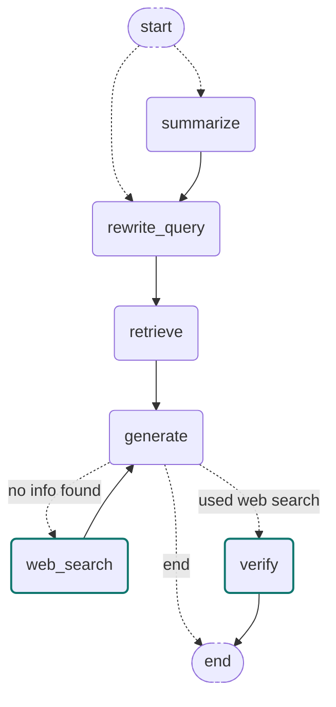

# My Personal AI

An "About Me" agentic RAG assistant: ask it questions about Vincent and it answers grounded in his real bio, resume, GitHub projects, and public web presence — with conversational memory across turns.

## Tech Stack

| Component | Tech | Notes |
|---|---|---|
| LLM | Ollama (default), Groq, Gemini, or OpenAI | Swappable via `.env`'s `LLM_PROVIDER`, or live in the chat UI's model dropdown — no code changes |
| Agent orchestration | LangGraph | `StateGraph` with conditional routing + per-thread checkpointing |
| Vector DB | Qdrant | Embedded/local file mode — no server or Docker needed |
| Dense embeddings | `sentence-transformers/all-mpnet-base-v2` | Semantic similarity search |
| Sparse embeddings | `Qdrant/bm25` (via `fastembed`) | Exact-keyword search, fused with dense via RRF |
| Frontend | Gradio `ChatInterface` | Per-browser-session conversation threads via `gr.State`, plus a model picker |
| Web fetching | Tavily Search + Extract APIs | Handles JS-heavy/protected pages better than raw `requests` |
| GitHub ingestion | PyGithub | Pulls READMEs (and a full repo manifest) from public repos |
| PDF ingestion | `pypdf` | Reads resume content |
| Observability | LangSmith | Auto-instrumented via env vars, no manual callback wiring |
| Testing | `pytest` | Fully offline — no live models/network required |

## Architecture & Strategies

**Hierarchical parent-child chunking ("small-to-big" retrieval).** Every source is split twice: small child chunks (~250 chars) get embedded and indexed for precise search, while larger parent chunks (~800 chars) are saved to `data/parent_store/parents.json`. At query time, search runs on the precise child vectors, but the LLM is given the full parent text each hit belongs to (deduped) — precision on the way in, context on the way out.

**Hybrid dense + sparse search.** Each chunk gets both a dense embedding (semantic meaning) and a sparse BM25 embedding (exact keywords). Qdrant fuses the two ranked lists at query time via Reciprocal Rank Fusion, so an exact term (a project name, a company name) isn't missed just because its dense embedding wasn't the closest semantic match.

**Agentic conversation via LangGraph.** Each turn runs through a small graph rather than a single LLM call — see [Agent Graph](#agent-graph) below for the full node-by-node flow, including the web-search fallback and its verification pass.

State (including full message history) is persisted per conversation via LangGraph's checkpointer, keyed by a `thread_id` that's threaded through Gradio's per-session `gr.State` — each browser tab gets its own independent, memory-preserving conversation. Every turn also resets the web-search-related state fields first — otherwise a web search from one question would silently keep polluting every later, unrelated question in the same conversation.

**Two "always available" anchors, independent of retrieval variance.** Two categories of question don't map well to top-k vector search: identity questions (where a wrong-person name collision on the web can get presented as fact) and enumeration questions ("list your repos" — there's no ranking/completeness signal in a similarity search). Rather than depend on retrieval to happen to surface the right thing, both get a dedicated, always-included answer:
- Vincent's actual bio is always included as "verified facts," so the model can sanity-check ambiguous or conflicting claims (especially from live web search) against real ground truth.
- Every ingested GitHub repo's name + description is written to a manifest at ingestion time and always included, so "how many/which repos" questions are answered from a complete list rather than whatever a handful of README chunks happened to retrieve.

**Structured self-grounding, not guessed-at phrasing.** The generation prompt asks the model to end every answer with a literal `GROUNDED: yes`/`GROUNDED: no` line, parsed out before display. This one structured signal is what decides whether to fall back to web search — far more reliable than pattern-matching English phrasings of "I don't know" after the fact (which reliably misses paraphrases like "doesn't *specifically* mention"). A phrase-list fallback still exists for models that drop the instruction.

**Live web-search fallback, with an independent verification pass.** If `generate`'s `GROUNDED: no` self-report fires, the graph routes to `web_search`, which turns the question into a keyword-style query (an LLM call turns "what sports did he play" into "Vincent Griest USTA tennis player" — search APIs rank actual pages far better on keywords than full sentences) biased toward "Vincent Griest" + "Oakland University" for disambiguation, then regenerates with the fresh results folded in. Because the name isn't unique, that regenerated answer then goes through a `verify` node — a second, independent LLM call that re-checks every web-sourced claim against the raw snippets, the local docs, and Vincent's verified facts, and rewrites out (or qualifies) anything that doesn't clearly match — catching real incidents where search returned a different, unrelated person who happens to share his name. If verification itself produces a broken response, the original draft is kept instead.

**Consistent third-person persona.** The model is instructed to always talk *about* Vincent by name/"he," silently reinterpreting "you"/"your" in questions as being about him rather than the assistant — with no meta-commentary on the phrasing. This also fixed an earlier version that inconsistently mixed first/second/third person depending on how a question was worded.

**Multi-source ingestion, one pipeline.** `document_loader.py` merges four sources into a single list of documents before chunking: `bio.md` (private, gitignored), `resume.pdf`, every public non-fork GitHub repo's README, and a configurable list of personal URLs. Each loader degrades gracefully — a missing GitHub username, an unset Tavily key, or a login-walled site (LinkedIn/Instagram/Handshake all block automated fetching) is skipped rather than crashing ingestion.

**LLM-provider abstraction, picked live in the UI.** `config.get_llm("provider:model")` lazily imports only the SDK it needs. The chat UI's model dropdown lists every Ollama model actually pulled on the machine (queried live via `/api/tags`) plus any cloud provider with a key set in `.env`, and `RAGSystem` caches one compiled graph per model choice so switching is instant after the first use.

## Agent Graph

Pulled directly from the compiled graph via `graph.get_graph().draw_mermaid()` — not hand-drawn:



- `summarize` and `rewrite_query` are each conditionally skipped (short history, first turn) rather than always run.
- `retrieve` also resets the web-search state fields for the new turn (see above), then runs hybrid search.
- `generate` always sees Vincent's verified facts and the complete GitHub repo manifest, on top of whatever `retrieve` (and, on a second pass, `web_search`) found.
- `web_search` only fires when `generate`'s first pass reports `GROUNDED: no`; `verify` only fires on turns where `web_search` actually ran, and always ends the turn.

## Project Structure

```
data/
  raw/           bio.md + resume.pdf (both gitignored, private) and bio.example.md (template)
  parent_store/  parent chunks + the GitHub repo manifest, both looked up at query time
qdrant_db/       Local Qdrant vector database files (hybrid dense+sparse collection)
src/
  config.py      Central settings + the LLM provider factory
  core/          RAGSystem orchestration, Gradio chat interface, thread/state management, LangSmith wiring
  rag_agent/     LangGraph agent: graph.py, state.py, nodes/ (conversation, retrieval, generation), prompts.py
  ingestion/     Document loading, parent-child chunking, dense+sparse embeddings, Qdrant client
  web/           GitHub README + repo-manifest connector, Tavily-based website scraper (also shared by the web-search fallback node)
tests/           Offline unit tests (pytest) for chunking, retrieval, and the agent's graph/nodes
```

## Setup

1. `python -m venv .venv` and activate it
2. `pip install -r requirements.txt`
3. Copy `.env.example` to `.env` and fill in values (at minimum, an LLM provider's API key or a running local Ollama)
4. Write your own bio into `data/raw/bio.md` (see `bio.example.md` for the template); optionally drop a `resume.pdf` alongside it
5. Run ingestion: `python -m src.ingestion.pipeline`
6. Launch the app: `python -m src.main`

Re-run ingestion any time source content changes. If chunk sizes or the vector schema change, clear `qdrant_db/` first and re-ingest from scratch.

**Restarting cleanly:** Qdrant's embedded mode holds an OS-level file lock on `qdrant_db/` for as long as the process is alive, so a second instance will fail to start with "Storage folder ... already accessed by another instance." Stop the running app with `Ctrl+C` in its terminal (a clean shutdown always releases the lock). If it's already stuck (terminal closed instead of `Ctrl+C`'d), free whatever's bound to port 7860 first:
```powershell
Get-NetTCPConnection -LocalPort 7860 -ErrorAction SilentlyContinue | ForEach-Object { Stop-Process -Id $_.OwningProcess -Force }
python -m src.main
```

## Known Limitations

- LinkedIn, Instagram, and Handshake profile pages are login-walled and fail to fetch even via Tavily — copy relevant content into `bio.md` manually if you want it included.
- A Steam profile page returned only generic site navigation, not real profile data (likely privacy settings or JS rendering) — same workaround applies.
- "Vincent Griest" isn't a unique name — live web search has surfaced real pages about different people who share it. The `verify` node catches most of this, but isn't perfect; anything web-sourced is worth a skeptical read.
- Questions that are honestly answerable locally but phrased ambiguously (e.g. asking for a "top 5" ranking the docs don't contain) can still trigger the web-search fallback unnecessarily — harmless, just a bit slower than it needs to be.
